# Lab7web
untuk memenuhi tugas pemogramman web

Nama : Antini permatasari<br>
NIM  : 312010095<br>
Kelas: TI.20.B.1<br>

## PHP Dasar

<hr>

## Instalasi XAMPP
Disini saya akan install terlebih dulu aplikasi XAMPP.<br>
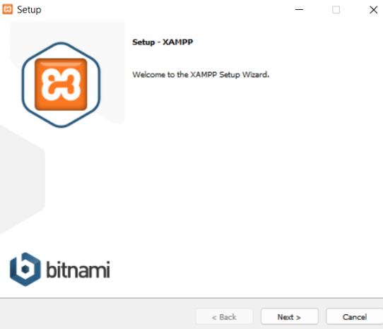<br>
Setelah selesai install <b>XAMPP</b>, lalu buka aplikasinya. Kemudian jalankan <b>Apache</b>.<br>
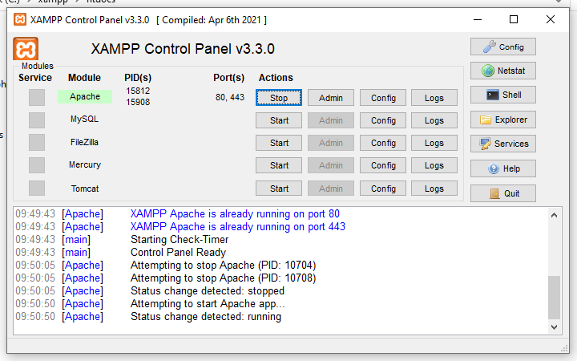<br>

Kemudian buka <b>Web Server</b>Pada google chrome, ketik http://localhost/ atau http://127.0.0.1/. Tampilan halaman tersebut seperti berikut :<br>
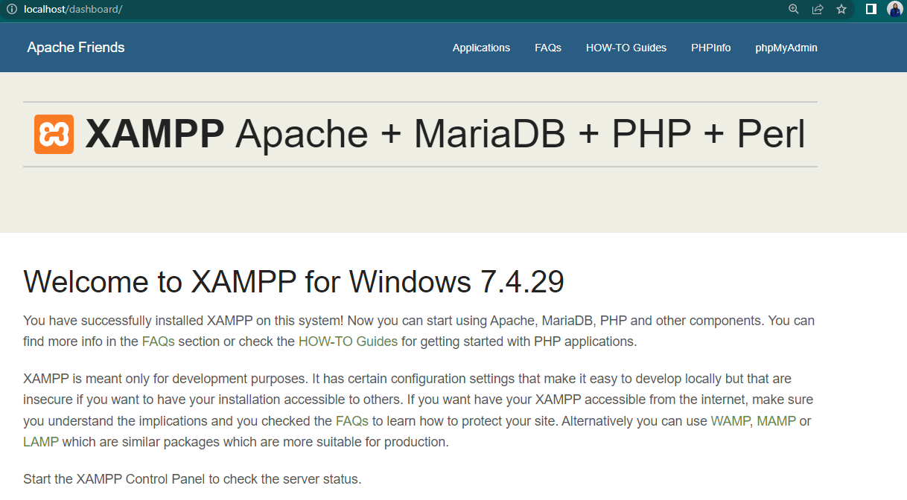<br>

## Memulai PHP
Disini Saya akan membuat folder baru dengan nama <b>lab7_php_dasar</b> pada folder <b>Lab7Web</b>.
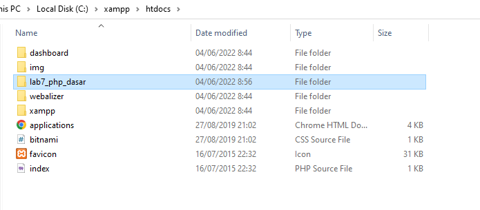 Berikut tampilannya di chrome : <br>
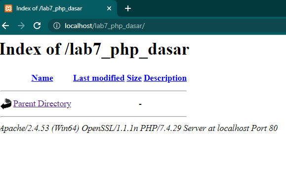<br>

## PHP Dasar
Selanjutnya saya akan membuat PHP Dasar Berikut syntaxnya :<br>
```
<!DOCTYPE html>
<html lang="en">
<head>
    <meta charset="UTF-8">
    <meta http-equiv="X-UA-Compatible" content="IE=edge">
    <meta name="viewport" content="width=device-width, initial-scale=1.0">
    <title>PHP Dasar</title>
</head>
<body>
    <h1>PHP Dasar</h1>
    <?php
        echo "Hello World";
    ?>
```
Berikut outputnya :<br>
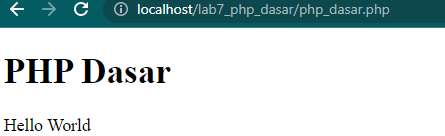<br>

## Variable PHP
selanjutnya saya akan membuat variable pada PHP.<br>
Berikut adalah syntaxnya
```
    <?php 
        $nim = "312010095"; 
        $nama = 'Antini permatasari'; 
        
        echo "NIM : " . $nim . "<br>"; 
        echo "Nama : $nama"; 
    ?>
```
Berikut outputnya<br>
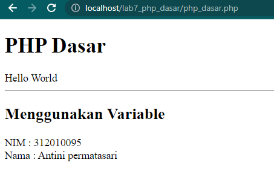<br>

## Predifine Variable
Pada predifine variable saya membuat file baru dengan nama latihan2.php.
```
    <?php
        echo "Selamat Datang ".$_GET['nama'];
    ?>
```
Lalu untuk mengaksesnya dengan membuka link berikut :<br>
Berikut outputnya<br>
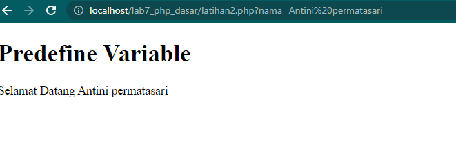<br>


## Membuat Form Input
Selanjutnya saya akan membuat form input,dengan nama <b>form_input.php</b>. Berikut syntaxnya
```
<!DOCTYPE html>
<html lang="en">
<head>
    <meta charset="UTF-8">
    <meta http-equiv="X-UA-Compatible" content="IE=edge">
    <meta name="viewport" content="width=device-width, initial-scale=1.0">
    <title>Form Input</title>
</head>
<body>
    <h2>Form Input</h2>
    <form method="post"> 
        <label>Nama: </label> 
        <input type="text" name="nama"> 
        <input type="submit" value="Kirim"> 
    </form> 
    
    <?php 
        echo 'Selamat Datang ' . $_POST['nama']; 
    ?>
</body>
</html>
```
berikut outputnya.<br>
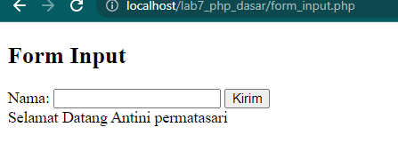<br>


## Operator
Selanjutnya saya akan buat operator aritmatika,dengan nama <b>operator.php</b>. Untuk syntaxnya sebagai berikut.<br>
```
    <?php 
    $gaji = 1000000; 
    $pajak = 0.1; $thp = $gaji - ($gaji*$pajak); 
    echo "Gaji sebelum pajak = Rp. $gaji <br>"; 
    echo "Gaji yang dibawa pulang = Rp. $thp"; 
    ?>
```
Berikut outputnya.<br>
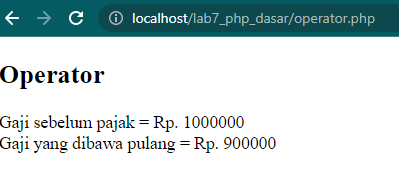<br>


## Kondisi If
Selanjutnya saya akan membuat Kondisi if dengan syntax sebagai berikut.<br>
```
    <?php 
    $nama_hari = date("l"); 
    if ($nama_hari == "Sunday") { 
        echo "Minggu"; 
    } elseif ($nama_hari == "Monday") { 
        echo "Senin"; 
    } else { 
        echo "Selasa"; 
    } 
    ?>
```
Berikut outputnya<br>
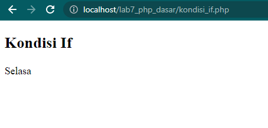<br>

## Kondisi Switch
Selanjutnya saya akan membuat Kondisi SWITCH Berikut syntaxnya.<br>
```
    <?php 
    $nama_hari = date("l"); 
    switch ($nama_hari) { 
        case "Sunday": 
            echo "Minggu"; 
            break; 
        case "Monday": 
            echo "Senin"; 
            break;
        case "Tuesday": 
            echo "Selasa"; 
            break; 
        default: 
            echo "Sabtu"; 
        }
    ?>
```

Berikut outputnya.<br>
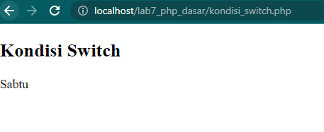<br>


## Perulangan For
lalu selanjunya saya akan membuat Perulangan for dengan syntax berikut.<br>
```
    <?php 
    echo "Perulangan 1 sampai 10 <br />"; 
    for ($i=1; $i<=10; $i++) { 
        echo "Perulangan ke: " . $i . '<br />'; 
    } 
    
    echo '<hr>';

    echo "Perulangan Menurun dari 10 ke 1 <br />"; 
    for ($i=10; $i>=1; $i--) { 
        echo "Perulangan ke: " . $i . '<br />'; 
    } 
    ?>
```

Berikut  outputnya.<br>
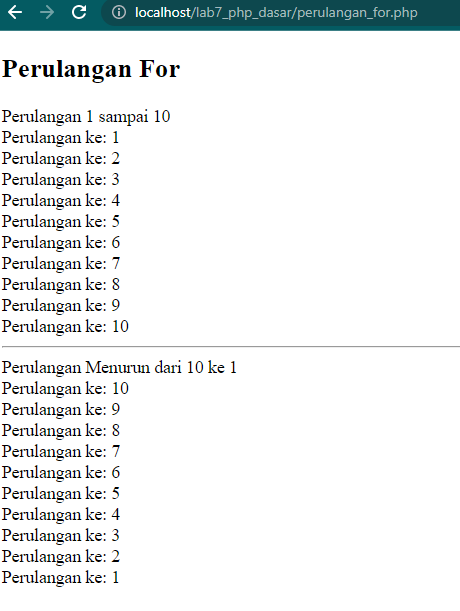<br>


## Perulangan While
Selanjutnya saya akan membuat Perulangan while dengan syntax sebagai berikut.<br>
```
    <?php 
    echo "Perulangan 1 sampai 10 <br />"; 
    $i=1; 
    while ($i<=10) { 
        echo "Perulangan ke: " . $i . '<br />'; 
        $i++; 
    } 
    ?>
```

Berikut Tampilan outputnya. <br>
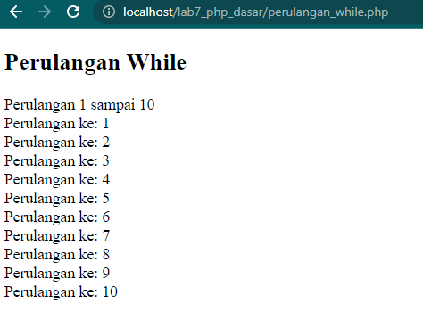<br>


## Perulangan Do While
Selanjunya saya akan membuat Perulangan while dengan syntax berikut.<br>
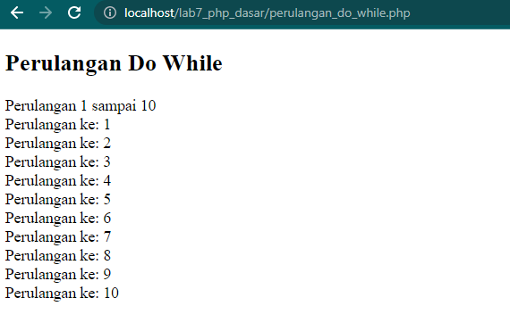<br>

<hr>

## Tugas Praktikum
Disini saya diberikan tugas untuk membuat program PHP sederhana dengan menggunakan form input yang menampilkan nama, tanggal lahir dan pekerjaan. Kemudian tampilkan outputnya dengan menghitung umur berdasarkan inputan tanggal lahir. Dan pilihan pekerjaan dengan gaji yang berbeda-beda sesuai pilihan pekerjaan.<br>

## Jawaban
Saya sudah membuat sesuai dengan Pilihan saya, yaitu : <br>
<b>Operator</b> dengan gaji Rp. 5.000.000<br>
Berikut adalah outputnya :<br>
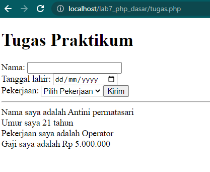